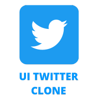
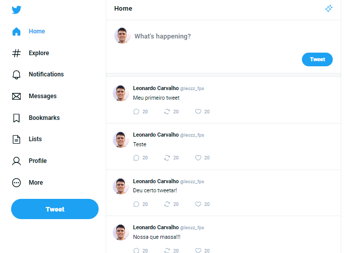
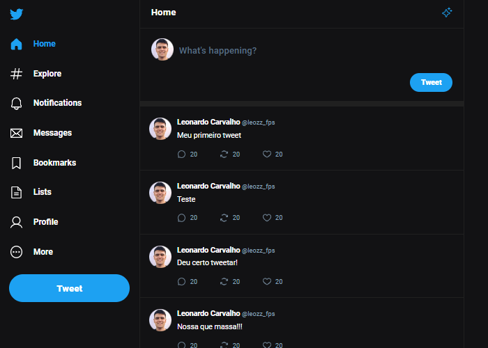
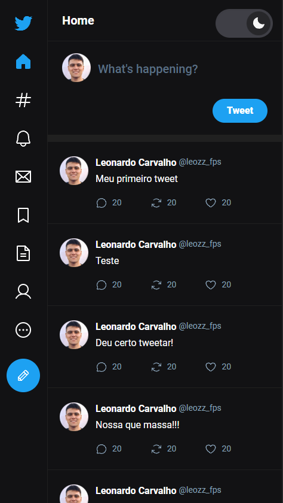

  <h1>UI Twitter Clone</h1>
  

## 🚀 Tema Light

  

## 🚀 Tema Dark

  

## 🚀 Mobile

  

## 🚀 Preview

  <a href="#-tecnologias">Tecnologias</a>&nbsp;&nbsp;&nbsp;|&nbsp;&nbsp;&nbsp;
  <a href="#-projeto">Projeto</a>

 

## 🚀 Tecnologias

Esse projeto foi desenvolvido com as seguintes tecnologias:

- [ReactJS](https://reactjs.org/)
- [Vite](https://vitejs.dev/)
- [Typescript](https://www.typescriptlang.org/)
- [TailwindCSS](https://tailwindcss.com/)

## 💻 Projeto

O objetivo deste projeto é praticar e aprimorar meu conhecimento react/typescipt/tailwindcss e a troca de theme da aplicação;

 

## 🚀 Autor

- [Leonardo Carvalho](https://www.linkedin.com/in/leocarvalhodev/)

Made with 💜 &nbsp;by Leonardo Carvalho 👋 &nbsp;[See my linkedin](https://www.linkedin.com/in/leocarvalhodev/)
